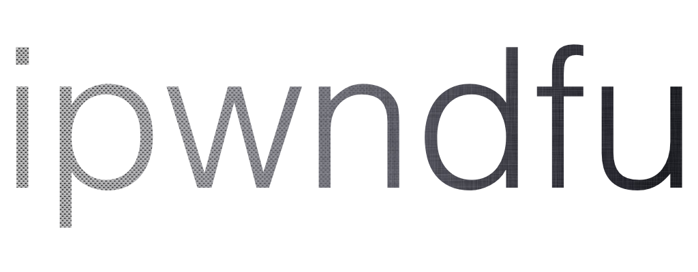

# Open-source jailbreaking tool for many iOS devices


**Read [disclaimer](#disclaimer) before using this software.*


## checkm8

* permanent unpatchable bootrom exploit for hundreds of millions of iOS devices

* meant for researchers, this is not a jailbreak with Cydia yet

* allows dumping SecureROM, decrypting keybags for iOS firmware, and demoting device for JTAG

* current SoC support: s5l8947x, s5l8950x, s5l8955x, s5l8960x, t8002, t8004, t8010, t8011, t8015

* future SoC support: s5l8940x, s5l8942x, s5l8945x, s5l8747x, t7000, t7001, s7002, s8000, s8001, s8003, t8012

* full jailbreak with Cydia on latest iOS version is possible, but requires additional work


## Quick start guide for checkm8

1. Use a cable to connect device to your Mac. Hold buttons as needed to enter DFU Mode.

2. First run ```./ipwndfu -p``` to exploit the device. Repeat the process if it fails, it is not reliable.

3. Run ```./ipwndfu --dump-rom``` to get a dump of SecureROM.

4. Run ```./ipwndfu --decrypt-gid KEYBAG``` to decrypt a keybag.

5. Run ```./ipwndfu --demote``` to demote device and enable JTAG.


## Features

* Jailbreak and downgrade iPhone 3GS (new bootrom) with alloc8 untethered bootrom exploit. :-)

* Pwned DFU Mode with steaks4uce exploit for S5L8720 devices.

* Pwned DFU Mode with limera1n exploit for S5L8920/S5L8922 devices.

* Pwned DFU Mode with SHAtter exploit for S5L8930 devices.

* Dump SecureROM on S5L8920/S5L8922/S5L8930 devices.

* Dump NOR on S5L8920 devices.

* Flash NOR on S5L8920 devices.

* Encrypt or decrypt hex data on a connected device in pwned DFU Mode using its GID or UID key.


## Dependencies

This tool should be compatible with Mac and Linux. It won't work in a virtual machine.

* libusb, `If you are using Linux: install libusb using your package manager.`
* [iPhone 3GS iOS 4.3.5 iBSS](#ibss)


## Tutorial

This tool can be used to downgrade or jailbreak iPhone 3GS (new bootrom) without SHSH blobs, as documented in [JAILBREAK-GUIDE](https://github.com/axi0mX/ipwndfu/blob/master/JAILBREAK-GUIDE.md).


## Exploit write-up

Write-up for alloc8 exploit can be found here:

https://github.com/axi0mX/alloc8


## iBSS

Download iPhone 3GS iOS 4.3.5 IPSW from Apple:

http://appldnld.apple.com/iPhone4/041-1965.20110721.gxUB5/iPhone2,1_4.3.5_8L1_Restore.ipsw

In Terminal, extract iBSS using the following command, then move the file to ipwndfu folder:

```
unzip -p iPhone2,1_4.3.5_8L1_Restore.ipsw Firmware/dfu/iBSS.n88ap.RELEASE.dfu > n88ap-iBSS-4.3.5.img3
```


## Coming soon!

* Reorganize and refactor code.

* Easier setup: download iBSS automatically using partial zip.

* Dump SecureROM on S5L8720 devices.

* Install custom boot logos on devices jailbroken with 24Kpwn and alloc8.

* Enable verbose boot on devices jailbroken with 24Kpwn and alloc8.

## Disclaimer

**This is BETA software.**

Backup your data.

This tool is currently in beta and could potentially brick your device. It will attempt to save a copy of data in NOR to nor-backups folder before flashing new data to NOR, and it will attempt to not overwrite critical data in NOR which your device requires to function. If something goes wrong, hopefully you will be able to restore to latest IPSW in iTunes and bring your device back to life, or use nor-backups to restore NOR to the original state, but I cannot provide any guarantees.

**There is NO warranty provided.**

THERE IS NO WARRANTY FOR THE PROGRAM, TO THE EXTENT PERMITTED BY APPLICABLE LAW. THE ENTIRE RISK AS TO THE QUALITY AND PERFORMANCE OF THE PROGRAM IS WITH YOU. SHOULD THE PROGRAM PROVE DEFECTIVE, YOU ASSUME THE COST OF ALL NECESSARY SERVICING, REPAIR OR CORRECTION.

## Toolchain

You will not need to use `make` or compile anything to use ipwndfu. However, if you wish to make changes to assembly code in `src/*`, you will need to use an ARM toolchain and assemble the source files by running `make`.

If you are using macOS with Homebrew, you can use binutils and gcc-arm-embedded. You can install them with these commands:

```
brew install binutils
brew cask install https://raw.githubusercontent.com/Homebrew/homebrew-cask/b88346667547cc85f8f2cacb3dfe7b754c8afc8a/Casks/gcc-arm-embedded.rb
```

## Credit

geohot for limera1n exploit

posixninja and pod2g for SHAtter exploit

chronic, CPICH, ius, MuscleNerd, Planetbeing, pod2g, posixninja, et al. for 24Kpwn exploit

pod2g for steaks4uce exploit

walac for pyusb
